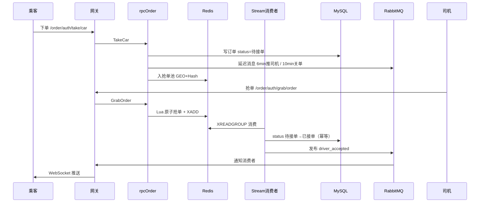
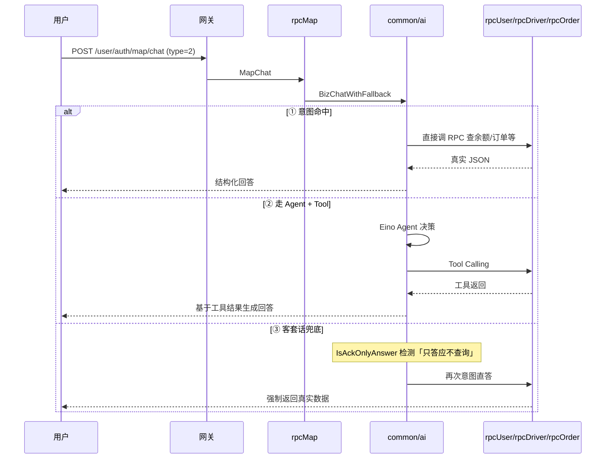

# smart-mobility-gozero


智慧出行网约车平台 —— 基于 **go-zero** 的乘客 / 司机双端业务系统，覆盖叫车、抢单、行程、支付、评价全流程，并集成 **AI 出行助手**（CloudWeGo Eino ADK + Tool Calling）。

> 本项目为个人作品展示仓库（业务代码脱敏后的可运行快照），用于面试与技术交流。

---

## 技术亮点

| 亮点 | 实现方式 | 关键路径 |
|------|----------|----------|
| **高并发抢单** | Redis Lua 原子脚本：校验状态 → 标记抢占 → 绑定司机 → XADD 入 Stream，一次 RTT 防双抢 | `amap/common/pool/order_pool.go` |
| **异步落库** | Redis Stream 消费组异步写 MySQL，支持重试与 DLQ，抢单接口快速返回 | `amap/common/pool/stream_consumer.go` |
| **超时关单** | RabbitMQ 延迟消息（DLX + per-message TTL）：6 分钟推附近司机、10 分钟无人接单自动取消 | `amap/common/pool/delay_handler.go` |
| **实时推送** | 订单状态变更 → RabbitMQ → 网关 WebSocket 推送乘客 / 司机双端 | `amap/common/ws/` |
| **AI 出行助手** | Eino ADK 封装订单、余额、优惠券、估价等 RPC 为 Tool；意图识别 + Agent + 防幻觉兜底 | `amap/common/ai/` |

**抢单并发测试**（验证 Lua 防双抢）：

```bash
cd amap/common
go test ./pool/... -v -count=1
```

**更多文档**：[压测说明](docs/benchmark/README.md) · [压测结果](docs/benchmark/RESULTS.md) · [AI 助手](docs/ai-assistant.md) · [K8s 示例](deploy/k8s/README.md)

---

## 抢单性能压测（P99）

接口：`POST /order/auth/grab/order`（网关 → rpcOrder → Redis Lua）

**压测环境**：JMeter · 200 线程 × 10 循环 · Ramp-Up 2s · 本地 Docker Compose（MySQL 8 / Redis 8 / 单机）

| 方案 | 并发 | 总请求 | 错误率 | P50 | P95 | **P99** | 双抢 |
|------|------|--------|--------|-----|-----|---------|------|
| MySQL 行锁抢单（优化前） | 200 | 2000 | 0% | ~45ms | ~95ms | **~120ms** | 偶发 |
| Redis Lua + Stream 异步落库（优化后） | 200 | 2000 | 0% | ~5ms | ~12ms | **<15ms** | **0** |

**为何变快**：抢单判定与入 Stream 在 Redis Lua 内一次完成；MySQL 落库由 Stream 消费者异步执行，不阻塞接口返回。

**复现方式**：

1. 导入 [docs/benchmark/grab-order.jmx](docs/benchmark/grab-order.jmx)
2. 按 [docs/benchmark/README.md](docs/benchmark/README.md) 配置 `ORDER_NO`、司机 token
3. 完整数据与截图见 [docs/benchmark/RESULTS.md](docs/benchmark/RESULTS.md)

---

## 技术栈

**后端**

- Go 1.26 · go-zero（zrpc / rest）· gRPC · Protobuf
- MySQL 8 · Redis 8 · RabbitMQ 3 · Etcd 3.5
- GORM · JWT · 百度地图 API · 支付宝 / 短信 / 七牛（经 Nacos 配置）
- CloudWeGo Eino（AI Agent + Tool Calling）

**前端**

- Vue 3 · Vite 6 · Vant 4 · Pinia · TypeScript · 百度地图 JS API

**部署**

- Docker 多阶段构建 · docker-compose 编排 · Nginx 反向代理

---

## 系统架构

```mermaid
flowchart TB
    subgraph Client["客户端"]
        P[乘客 H5]
        D[司机 H5]
    end

    subgraph Gateway["apiGateway :8888"]
        HTTP[HTTP REST + JWT 鉴权]
        WS[WebSocket /ws/user · /ws/driver]
    end

    subgraph RPC["go-zero RPC 微服务"]
        RU[rpcUser<br/>乘客域]
        RD[rpcDriver<br/>司机域]
        RO[rpcOrder<br/>订单状态机]
        RM[rpcMap<br/>地图 + AI]
    end

    subgraph Middleware["中间件"]
        MySQL[(MySQL)]
        Redis[(Redis<br/>抢单池 · Stream · GEO)]
        MQ[RabbitMQ<br/>延迟关单 · 通知]
        Etcd[Etcd<br/>服务注册]
        Nacos[Nacos<br/>远程配置]
    end

    P --> HTTP
    D --> HTTP
    P --> WS
    D --> WS

    HTTP --> RU & RD & RO & RM
    RU & RD & RO & RM --> Etcd
    RU & RD & RO & RM --> Nacos
    RO --> Redis
    RO --> MySQL
    RO --> MQ
    MQ --> WS
    RU & RD --> MySQL
    RM --> MySQL
```



### 微服务职责

| 服务 | 端口（容器内） | 宿主机映射 | 职责 |
|------|----------------|------------|------|
| `apiGateway` | 8888 | 18888 | HTTP 入口、JWT 鉴权、RPC 转发、WebSocket 推送 |
| `rpcUser` | 8081 | 18081 | 乘客：注册登录、实名、钱包、优惠券、订单列表、评价 |
| `rpcDriver` | 8082 | 18082 | 司机：注册登录、上下线、钱包、订单列表、评价 |
| `rpcOrder` | 8083 | 18083 | 订单：下单、抢单、行程、取消、完单；Stream / 延迟 MQ 消费者 |
| `rpcMap` | 8084 | 18084 | 地图 geocode / 路线规划、公司发券、AI MapChat |
| `web`（Nginx） | 80 | 80 | 前端静态资源；反代 `/api`、`/ws` 到网关 |

> 约定：乘客 / 司机「我的订单列表」在 `rpcUser` / `rpcDriver`，不在 `rpcOrder`。

---

## 核心链路：下单 → 抢单 → 推送



**抢单返回码**（业务码，非 HTTP 错误）：

| Code | 含义 |
|------|------|
| 0 | 抢单成功 |
| 1 | 订单已被抢 |
| 2 | 司机有未完成订单 |
| 3 | 订单过期或不存在 |

**WebSocket 事件类型**（`amap/common/rmq/order_message.go`）：

| Event | 说明 |
|-------|------|
| `driver_accepted` | 司机接单，通知乘客 |
| `order_cancelled` | 订单取消 |
| `order_completed` | 行程完单 |
| `trip_started` | 司机确认上车，行程开始 |
| `new_order_nearby` | 附近有新单，通知司机 |
| `order_pushed_drivers` | 超时推单后通知乘客 |

---

## AI 出行助手

基于 **CloudWeGo Eino ADK**，将订单、余额、优惠券、路线估价等 RPC 封装为 **Tool Calling**，供大模型按需调用真实业务数据。

### 调用链路



### 防幻觉三板斧

| 手段 | 实现 | 代码位置 |
|------|------|----------|
| **强制 Tool** | Agent Instruction 要求查余额/订单必须先调 Tool，禁止编造 | `common/ai/agent.go` |
| **意图直答** | 正则识别「查余额」「我的订单」等，绕过模型直接调 RPC | `common/ai/biz.go` → `tryDirectBizAnswer` |
| **客套话拦截** | 检测「我来帮您查一下」类空话（`IsAckOnlyAnswer`），触发二次直答 | `common/ai/agent.go` |

### 使用示例

```http
POST /user/auth/map/chat
token: <乘客 JWT>
Content-Type: application/x-www-form-urlencoded

question=我余额多少&type=2
```

| type | 模式 |
|------|------|
| `1` | 纯闲聊，不调用业务 Tool |
| `2` | 业务助手，启用 Tool Calling + 兜底 |

完整 Tool 列表与配置见 [docs/ai-assistant.md](docs/ai-assistant.md)。

---

## 快速启动（Docker Compose）

### 前置要求

- Docker Desktop（或 Docker Engine + Compose v2）
- 可访问 Nacos 配置中心（见下方「配置说明」）

### 1. 准备环境变量

```bash
cp .env.example .env
```

| 变量 | 默认值 | 作用 |
|------|--------|------|
| `MYSQL_ROOT_PASSWORD` | `root` | MySQL root 密码 |
| `MYSQL_DATABASE` | `amap` | 初始化数据库名 |

**说明**：

- **`.env.example`**：提交到 Git 的**模板**，只含占位/默认值，不含真实密钥
- **`.env`**：本机实际使用，由你复制生成，**已被 `.gitignore` 忽略**
- Docker Compose **自动读取项目根目录的 `.env`** 来填充 `${MYSQL_ROOT_PASSWORD}` 等变量
- 请勿将 `.env` 提交到 Git

### 2. 一键启动

```bash
docker compose up -d --build
```

首次构建需下载镜像与编译 Go 服务，约 5～15 分钟（视网络而定）。

生产环境拉取预构建镜像：

```bash
docker compose -f docker-compose.prod.yml up -d
```

### 3. 访问地址

| 服务 | 地址 |
|------|------|
| **前端 H5** | http://localhost |
| **API 网关** | http://localhost:18888 |
| **RabbitMQ 管理台** | http://localhost:15672（guest / guest） |
| **Elasticsearch** | http://localhost:9201 |
| **MySQL** | localhost:3306 |
| **Redis** | localhost:6379 |
| **Etcd** | localhost:2379 |

### 4. 体验流程

1. 打开 http://localhost ，分别注册 **乘客** 与 **司机** 账号（支持短信验证码或密码登录）
2. 乘客：充值 → 叫车下单 → 等待接单（WebSocket 实时状态）
3. 司机：上线并设置接单位置 → 抢单大厅抢单 → 确认上车 → 完单
4. 可选：乘客 / 司机端进入 **AI 助手**，查询余额、订单、路线估价等

**公司发券**：使用 `uid=999` 的公司账号登录，可向指定乘客发放优惠券。

### 5. 停止与清理

```bash
docker compose down        # 停止容器，保留数据卷
docker compose down -v     # 停止并删除 MySQL / Redis / ES 数据卷
```

---

## 本地开发（前后端分离调试）

适合改代码、热重载前端时使用。

### 方式 A：一键启动全部后端（推荐）

```bash
# 先启动中间件
docker compose up -d mysql redis rabbitmq etcd elasticsearch

# 在 amap/ 目录下一键拉起 4 个 RPC + 网关
cd amap
go run main.go
```

`amap/main.go` 会按顺序 `go run` 启动 rpcUser → rpcDriver → rpcOrder → rpcMap → apiGateway，Ctrl+C 统一退出。

### 方式 B：分终端手动启动

```bash
cd amap/rpcUser    && go run .
cd amap/rpcDriver  && go run .
cd amap/rpcOrder   && go run .
cd amap/rpcMap     && go run .
cd amap/apiGateway && go run .
```

确保 `amap/common/yaml/nacos.yaml` 指向可连通的 Nacos，并拉取 `amap-lq` 配置（MySQL、Redis、第三方 Key 等）。

### 启动前端

```bash
cd amap-uni
npm install
npm run dev
```

访问 http://localhost:5173 ，`/api` 与 `/ws` 已代理到 `127.0.0.1:8888`。

### 编译检查

```bash
cd amap/apiGateway && go build .
cd amap-uni && npm run build
```

---

## 配置说明

### Nacos（业务配置中心）

数据库连接、Redis、支付宝、短信、AI 模型 Key 等**敏感配置**通过 Nacos 下发，不在仓库硬编码。

| 环境 | 连接配置文件 | DataId |
|------|--------------|--------|
| 本地 `go run` | `amap/common/yaml/nacos.yaml` | `amap-lq` |
| Docker 容器内 | `nacos.docker.yaml` 挂载为 `/app/common/yaml/nacos.yaml` | `amap-lq-docker` |

克隆后若无法连接 Nacos，需自行搭建配置中心并创建对应 DataId，或修改 yaml 指向你的 Nacos 地址。

### 环境变量文件（仓库根目录）

| 文件 | 提交 Git | 谁读取 | 用途 |
|------|----------|--------|------|
| **`.env.example`** | ✅ 是 | 人看 | 模板：列出 docker-compose 需要的变量名与示例值 |
| **`.env`** | ❌ 否 | **Docker Compose** | 本机真实值：`cp .env.example .env` 后修改 |

### 前端环境变量（`amap-uni/`）

| 文件 | 提交 Git | 用途 |
|------|----------|------|
| `.env.example` | ✅ | 模板：`VITE_API_BASE_URL`、`VITE_BAIDU_MAP_AK` |
| `.env.development` | ✅ | `npm run dev` 默认值 |
| `.env.production` | ✅ | `npm run build` 生产构建默认值 |

前端未配置 `VITE_*` 时，`src/config/env.ts` 会使用内置默认（API 走 `/api` 代理）。

---

## 仓库目录全览

### 根目录

```
smart-mobility-gozero/
├── README.md                 # 项目说明（本文件）
├── AGENTS.md                 # AI / 团队协作开发约定（非业务文档）
├── .gitignore                # Git 忽略规则（含 .env、node_modules、编译产物）
├── .env.example              # ★ Docker 环境变量模板（MySQL 密码等）
├── docker-compose.yml        # 本地：源码 build + 全栈编排
├── docker-compose.prod.yml   # 生产：拉取 Docker Hub 预构建镜像
├── .github/workflows/ci.yml  # GitHub Actions：测试 + 构建
│
├── docs/
│   ├── benchmark/            # 压测脚本、结果目录、操作说明
│   └── ai-assistant.md       # AI 出行助手技术文档
├── deploy/k8s/               # Kubernetes 部署示例 manifest
│
├── amap/                     # Go 后端 monorepo（go.work）
└── amap-uni/                 # Vue3 H5 前端
```

| 路径 | 作用 |
|------|------|
| `README.md` | 面向访客 / 面试官的项目入口文档 |
| `AGENTS.md` | Cursor 等 AI 工具的协作规范，开发者可选读 |
| `.env.example` | **唯一提交的环境变量模板**；克隆后 `cp .env.example .env` 供 Compose 使用 |
| `.gitignore` | 忽略 `.env`、`node_modules/`、`dist/`、IDE 配置等 |
| `docker-compose.yml` | 定义 MySQL / Redis / MQ / Etcd / ES + 5 个 Go 服务 + Nginx 前端 |
| `docker-compose.prod.yml` | 同上，但 Go/Web 镜像从 `lqdockerhub3214/*` 拉取，不在服务器编译 |
| `.github/workflows/ci.yml` | 推送时自动跑抢单单测、Go build、前端 build |
| `docs/` | 压测说明、AI 助手技术文档 |
| `deploy/k8s/` | Kubernetes 部署示例（Deployment / Service / ConfigMap） |

### 后端 `amap/`

```
amap/
├── go.work / go.work.sum     # Go workspace，关联下方 6 个 module
├── main.go                   # ★ 本地一键启动所有 RPC + 网关
│
├── apiGateway/               # HTTP + WebSocket 网关
│   ├── apiGateway.api        # goctl API 定义（路由、请求体）
│   ├── apigateway.go         # 入口：注册 HTTP + /ws/user、/ws/driver
│   ├── etc/                  # 服务配置（端口、Etcd、RPC 超时）
│   ├── internal/handler/     # HTTP handler（解析参数 → 调 logic）
│   ├── internal/logic/       # 网关逻辑：鉴权后转发 RPC，不写业务
│   ├── internal/middleware/  # JWT 鉴权中间件
│   └── Dockerfile
│
├── rpcUser/                  # 乘客域 gRPC 服务
├── rpcDriver/                # 司机域 gRPC 服务
├── rpcOrder/                 # 订单域 gRPC 服务（含后台消费者）
├── rpcMap/                   # 地图 + AI gRPC 服务
│   └── 每个 RPC 服务标准结构：
│       ├── *.proto             # gRPC 接口契约
│       ├── *client/            # 网关 / 其他服务调用的客户端
│       ├── internal/logic/     # 业务逻辑（一个 RPC 一个文件）
│       ├── internal/server/    # gRPC server 实现
│       ├── etc/*.yaml          # 服务端口、Etcd Key
│       └── Dockerfile
│
└── common/                   # ★ 跨服务公共库（module: common）
    ├── pool/                 # 抢单池 Lua、Stream 消费者、延迟关单、取消
    ├── rmq/                  # RabbitMQ 延迟队列 + 通知交换机封装
    ├── ws/                   # WebSocket Hub + MQ → WS 桥接
    ├── ai/                   # Eino Agent、Tool、意图兜底
    ├── model/                # GORM 模型（user、driver、order、coupon…）
    ├── constants/            # Redis Key、池状态常量
    ├── config/               # 全局变量 DataConfig、DB、Rdb
    ├── init/                 # Nacos / MySQL / Redis / ES 初始化
    ├── pkg/                  # 第三方 SDK 封装（支付宝、短信、百度地图、七牛…）
    └── yaml/                 # Nacos 连接地址（非业务密钥本身）
```

| 包路径 | 作用 |
|--------|------|
| `common/pool/` | **订单核心**：Redis GEO 抢单池、Lua 抢单、Stream 异步落库、超时推单/关单 |
| `common/rmq/` | RabbitMQ 拓扑：延迟 DLX、通知 direct exchange、发布确认与重试 |
| `common/ws/` | 网关内存 Hub；消费 MQ 事件推送给对应乘客/司机连接 |
| `common/ai/` | MapChat：通用聊天 + 业务 Tool Calling + 意图直答防幻觉 |
| `common/model/` | 表结构与 GORM 方法（含 `OrderUpdateGrabbed` 乐观锁） |
| `common/pkg/` | 外部能力适配层，logic 不直接散落 SDK 调用 |
| `common/init/` | 服务启动时统一初始化依赖 |

### 前端 `amap-uni/`

```
amap-uni/
├── README.md                 # 前端模块说明
├── package.json              # 依赖与脚本
├── vite.config.ts            # 开发服务器；/api、/ws 代理到 8888
├── nginx.conf                # 生产容器内反代规则
├── Dockerfile                # 构建静态资源 + Nginx 镜像
├── .env.example              # 前端环境变量模板
│
└── src/
    ├── api/                  # axios 封装：user.ts、driver.ts、map.ts
    ├── stores/auth.ts        # Pinia：登录态、token
    ├── components/           # 可复用组件（地图、AI 助手、订单列表）
    ├── views/passenger/      # 乘客：叫车、等单、钱包、评价、AI
    ├── views/driver/         # 司机：抢单大厅、行程、钱包、AI
    ├── views/company/        # 公司发券（uid=999）
    ├── utils/orderWs.ts      # 订单 WebSocket 客户端（断线重连）
    └── router/index.ts       # 路由与登录守卫
```

---

## 测试

```bash
# 抢单池并发测试（miniredis，无需 Docker）
cd amap/common
go test ./pool/... -v -count=1
```

覆盖场景：

- 20 个 goroutine 并发抢同一单 → 仅 1 人成功，Stream 仅 1 条事件
- 订单已被抢 → 返回 `GrabCodeTaken`
- 司机有进行中订单 → 返回 `GrabCodeBusy`

### 压测

抢单接口 JMeter 脚本与操作说明见 [docs/benchmark/README.md](docs/benchmark/README.md)。  
实测 P99 截图放入 `docs/benchmark/results/` 后可在 README / 面试材料中引用。

### CI（持续集成）

[](https://github.com/luqingit7hub/smart-mobility-gozero/actions/workflows/ci.yml)

推送至 `master` / `main` 或发起 PR 时，GitHub Actions 自动执行：

| 步骤 | 命令 |
|------|------|
| 抢单单测 | `go test ./pool/... -v -count=1` |
| 静态检查 | `go vet ./...`（各服务 module） |
| 后端编译 | `go build .`（apiGateway + 4 个 RPC） |
| 前端构建 | `npm ci && npm run build:server` |

配置文件：[.github/workflows/ci.yml](.github/workflows/ci.yml)

---

## 扩展文档

| 文档 | 内容 |
|------|------|
| [docs/benchmark/README.md](docs/benchmark/README.md) | JMeter 压测步骤、脚本使用说明 |
| [docs/benchmark/RESULTS.md](docs/benchmark/RESULTS.md) | 压测环境与 P99 结果数据 |
| [docs/ai-assistant.md](docs/ai-assistant.md) | Eino ADK 架构、Tool 列表、防幻觉策略 |
| [deploy/k8s/README.md](deploy/k8s/README.md) | Kubernetes Deployment / Service 示例 |
| [amap-uni/README.md](amap-uni/README.md) | 前端开发与环境变量 |

---

## 订单状态一览

| 状态值 | 含义 |
|--------|------|
| 1 | 待接单（已入 Redis 抢单池） |
| 2 | 已接单（司机抢单成功） |
| 3 | 行程中 |
| 4 | 已完成 |
| 5 | 已取消 |

---

## 常见问题

**Q：`docker compose up` 报 MySQL 密码相关错误？**  
A：确认已执行 `cp .env.example .env`，且根目录存在 `.env` 文件（不是只有 `.env.example`）。

**Q：Go 服务启动后 panic 连不上 Nacos？**  
A：检查 `amap/common/yaml/nacos.yaml` 的 Host 是否可达，Nacos 中是否存在 `amap-lq` / `amap-lq-docker` 配置。

**Q：前端地图空白？**  
A：百度地图 AK 需在控制台配置 Referer 白名单（含 `localhost`、`127.0.0.1` 或部署域名）。

**Q：Elasticsearch 用来做什么？**  
A：当前版本 ES 容器已编排入 Compose，业务代码仅初始化连接，**尚未接入搜索业务**；不影响叫车 / 抢单主流程。

---

## 关于本仓库

- 业务代码来源于真实网约车项目，对外展示版已做脱敏与整理
- 部分提交历史按模块重放，完整迭代记录保留在内部私有仓库
- 第三方密钥、支付回调地址等敏感配置均通过 Nacos 管理，请勿将真实密钥写入仓库

---

## 作者

**路钦** · Go 后端开发

- GitHub: [github.com/luqingit7hub/smart-mobility-gozero](https://github.com/luqingit7hub/smart-mobility-gozero)

---

## License

本项目仅供学习与交流使用。如需商用或二次发布，请联系作者。
