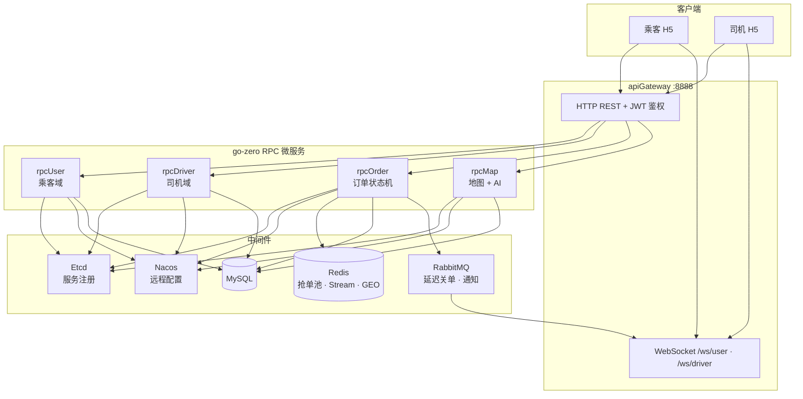

# smart-mobility-gozero

智慧出行网约车平台 —— 基于 **go-zero** 的乘客 / 司机双端业务系统，覆盖叫车、抢单、行程、支付、评价全流程，并集成 **AI 出行助手**（CloudWeGo Eino ADK + Tool Calling）。

> 本项目为个人作品展示仓库（业务代码脱敏后的可运行快照），用于面试与技术交流。

---

## 技术亮点

| 亮点 | 实现方式 | 关键路径 |
|------|----------|----------|
| **高并发抢单** | Redis Lua 原子脚本：校验状态 → 标记抢占 → 绑定司机 → XADD 入 Stream，一次 RTT 防双抢 | `amap/common/pool/order_pool.go` |
| **异步落库** | Redis Stream 消费组异步写 MySQL，支持重试与 DLQ，抢单接口快速返回 | `amap/common/pool/stream_consumer.go` |
| **超时关单** | RabbitMQ 延迟消息（DLX + per-message TTL）：6 分钟推附近司机、10 分钟无人接单自动取消 | `amap/common/pool/delay_handler.go` |
| **实时推送** | 订单状态变更 → RabbitMQ → 网关 WebSocket 推送乘客 / 司机双端 | `amap/common/ws/` |
| **AI 出行助手** | Eino ADK 封装订单、余额、优惠券、估价等 RPC 为 Tool；意图识别 + Agent + 防幻觉兜底 | `amap/common/ai/` |

**抢单并发测试**（验证 Lua 防双抢）：

```bash
cd amap/common
go test ./pool/... -v -count=1
```

---

## 技术栈

**后端**

- Go 1.26 · go-zero（zrpc / rest）· gRPC · Protobuf
- MySQL 8 · Redis 8 · RabbitMQ 3 · Etcd 3.5
- GORM · JWT · 百度地图 API · 支付宝 / 短信 / 七牛（经 Nacos 配置）
- CloudWeGo Eino（AI Agent + Tool Calling）

**前端**

- Vue 3 · Vite 6 · Vant 4 · Pinia · TypeScript

**部署**

- Docker 多阶段构建 · docker-compose 编排 · Nginx 反向代理

---

## 系统架构



### 微服务职责

| 服务 | 端口（容器内） | 职责 |
|------|----------------|------|
| `apiGateway` | 8888 | HTTP 入口、JWT 鉴权、RPC 转发、WebSocket 推送 |
| `rpcUser` | 8081 | 乘客：注册登录、实名、钱包、优惠券、订单列表、评价 |
| `rpcDriver` | 8082 | 司机：注册登录、上下线、钱包、订单列表、评价 |
| `rpcOrder` | 8083 | 订单：下单、抢单、行程、取消、完单；Stream / 延迟 MQ 消费者 |
| `rpcMap` | 8084 | 地图 geocode / 路线规划、公司发券、AI MapChat |

> 约定：乘客 / 司机「我的订单列表」在 `rpcUser` / `rpcDriver`，不在 `rpcOrder`。

---

## 核心链路：下单 → 抢单 → 推送


**抢单返回码**（业务码，非 HTTP 错误）：

| Code | 含义 |
|------|------|
| 0 | 抢单成功 |
| 1 | 订单已被抢 |
| 2 | 司机有未完成订单 |
| 3 | 订单过期或不存在 |

---

## 快速启动（Docker Compose）

### 前置要求

- Docker Desktop（或 Docker Engine + Compose v2）
- 可访问 Nacos 配置中心（见下方「配置说明」）

### 1. 准备环境变量

```bash
cp .env.example .env.local
# 默认即可：MYSQL_ROOT_PASSWORD=root  MYSQL_DATABASE=amap
```

> `.env.local` 仅用于本机，已被 `.gitignore` 忽略，不会提交到 Git。

### 2. 一键启动

```bash
docker compose up -d --build
```

首次构建需下载镜像与编译 Go 服务，约 5～15 分钟（视网络而定）。

### 3. 访问地址

| 服务 | 地址 |
|------|------|
| **前端 H5** | http://localhost |
| **API 网关** | http://localhost:18888 |
| **RabbitMQ 管理台** | http://localhost:15672（guest / guest） |
| **MySQL** | localhost:3306 |
| **Redis** | localhost:6379 |
| **Etcd** | localhost:2379 |

### 4. 体验流程

1. 打开 http://localhost ，分别注册 **乘客** 与 **司机** 账号（支持短信验证码或密码登录）
2. 乘客：充值 → 叫车下单 → 等待接单（WebSocket 实时状态）
3. 司机：上线并设置接单位置 → 抢单大厅抢单 → 确认上车 → 完单
4. 可选：乘客 / 司机端进入 **AI 助手**，查询余额、订单、路线估价等

**公司发券**：使用 `uid=999` 的公司账号登录，可向指定乘客发放优惠券。

### 5. 停止与清理

```bash
docker compose down        # 停止容器，保留数据卷
docker compose down -v     # 停止并删除 MySQL / Redis / ES 数据卷
```

---

## 本地开发（前后端分离调试）

适合改代码、热重载前端时使用。

### 1. 启动基础设施

```bash
docker compose up -d mysql redis rabbitmq etcd elasticsearch
```

### 2. 启动后端（各开一个终端）

```bash
# 在 amap/ 下，按依赖顺序启动
cd amap/rpcUser   && go run .
cd amap/rpcDriver && go run .
cd amap/rpcOrder  && go run .
cd amap/rpcMap    && go run .
cd amap/apiGateway && go run .
```

确保 `amap/common/yaml/nacos.yaml` 指向可连通的 Nacos，并拉取 `amap-lq` 配置（MySQL、Redis、第三方 Key 等）。

### 3. 启动前端

```bash
cd amap-uni
npm install
npm run dev
```

访问 http://localhost:5173 ，`/api` 与 `/ws` 已代理到 `127.0.0.1:8888`。

### 4. 编译检查

```bash
cd amap/apiGateway && go build .
cd amap-uni && npm run build
```

---

## 配置说明

### Nacos

业务配置（数据库、Redis、支付宝、短信、AI 模型等）通过 **Nacos** 下发，不在仓库中硬编码密钥。

| 环境 | 配置文件 | DataId |
|------|----------|--------|
| 本地开发 | `amap/common/yaml/nacos.yaml` | `amap-lq` |
| Docker | `amap/common/yaml/nacos.docker.yaml`（挂载进容器） | `amap-lq-docker` |

克隆后若无法连接 Nacos，需自行搭建配置中心，或在本地 Nacos 中创建对应 DataId 的配置项。

### 环境变量文件约定

| 文件 | 是否提交 Git | 用途 |
|------|--------------|------|
| `.env.example` | ✅ | 模板，仅含占位符 |
| `.env.local` | ❌ | 本机 docker-compose 用（MySQL 密码等） |

---

## 目录结构

```
smart-mobility-gozero/
├── README.md                 # 本文件
├── docker-compose.yml        # 本地构建 + 全栈编排
├── docker-compose.prod.yml   # 生产镜像拉取编排
├── .env.example              # 环境变量模板
│
├── amap/                     # Go 后端（go.work 工作区）
│   ├── apiGateway/           # HTTP + WebSocket 网关
│   ├── rpcUser/              # 乘客服务
│   ├── rpcDriver/            # 司机服务
│   ├── rpcOrder/             # 订单服务（含 Stream / 延迟 MQ 消费者）
│   ├── rpcMap/               # 地图 + AI 服务
│   └── common/               # 公共库
│       ├── pool/             # ★ 抢单池、Stream 消费者、延迟处理
│       ├── rmq/              # RabbitMQ 封装
│       ├── ws/               # WebSocket Hub
│       ├── ai/               # Eino Agent + Tool Calling
│       ├── model/            # GORM 模型
│       └── yaml/             # Nacos 连接配置
│
└── amap-uni/                 # Vue3 H5 前端
    └── src/
        ├── views/passenger/  # 乘客：叫车、等单、钱包、AI
        ├── views/driver/     # 司机：抢单大厅、行程、AI
        └── utils/orderWs.ts  # 订单 WebSocket 客户端
```

---

## 测试

```bash
# 抢单池并发测试（miniredis，无需 Docker）
cd amap/common
go test ./pool/... -v -count=1
```

覆盖场景：

- 20 个 goroutine 并发抢同一单 → 仅 1 人成功，Stream 仅 1 条事件
- 订单已被抢 → 返回 `GrabCodeTaken`
- 司机有进行中订单 → 返回 `GrabCodeBusy`

---

## 订单状态一览

| 状态值 | 含义 |
|--------|------|
| 1 | 待接单（已入 Redis 抢单池） |
| 2 | 已接单（司机抢单成功） |
| 3 | 行程中 |
| 4 | 已完成 |
| 5 | 已取消 |

---

## 关于本仓库

- 业务代码来源于真实网约车项目，对外展示版已做脱敏与整理
- 部分提交历史按模块重放，完整迭代记录保留在内部私有仓库
- 第三方密钥、支付回调地址等敏感配置均通过 Nacos 管理，请勿将真实密钥写入仓库

---

## 作者

**路钦** · Go 后端开发

- GitHub: [github.com/luqingit7hub/smart-mobility-gozero](https://github.com/luqingit7hub/smart-mobility-gozero)

---

## License

本项目仅供学习与交流使用。如需商用或二次发布，请联系作者。
