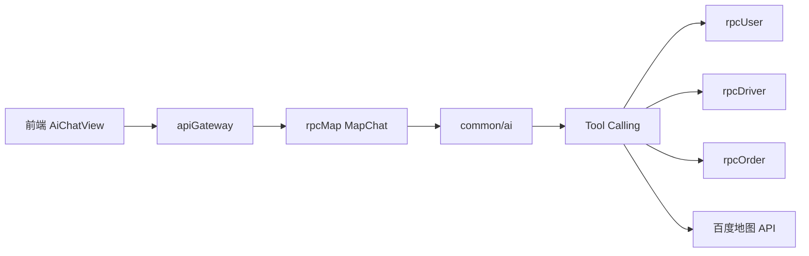

# AI 出行助手

基于 **CloudWeGo Eino ADK** 实现的网约车业务智能助手，支持乘客 / 司机双端，通过 **Tool Calling** 查询真实业务数据，避免模型幻觉。

## 架构



## 入口

| 端 | HTTP 接口 | 说明 |
|----|-----------|------|
| 乘客 | `POST /user/auth/map/chat` | 需乘客 token |
| 司机 | `POST /driver/auth/map/chat` | 需司机 token |

请求体（`MapChatReq`）：

| 字段 | 说明 |
|------|------|
| `question` | 用户问题 |
| `type` | `1` = 纯闲聊；`2` = 业务助手（启用 Tool） |

## 分层策略

实现位于 `amap/common/ai/biz.go` → `BizChatWithFallback`：

```
用户提问
    ↓
① 意图识别 + 直答（tryDirectBizAnswer）
    ├─ 命中 → 直接调 RPC 返回真实数据
    └─ 未命中 ↓
② Eino Agent + Tool Calling（BizChat）
    ├─ 正常回答 → 返回
    └─ 仅客套话（IsAckOnlyAnswer）↓
③ 再次意图直答兜底
```

**目的**：简单问题不走大模型，降低延迟与 token 成本；模型「敷衍」时仍能用规则兜底查到真实数据。

## Tool 列表

### 地图类（`common/ai/tools_map.go`）

| Tool | 说明 |
|------|------|
| `geocode` | 地址 → 经纬度 |
| `path_plan` | 路线规划（百度地图） |

### 业务类（`common/ai/biz.go`，由 rpcMap 注入 Backend）

| Tool | 角色 | 说明 |
|------|------|------|
| `get_my_balance` | 乘客 / 司机 | 查询当前余额 |
| `list_my_orders` | 乘客 / 司机 | 分页查订单列表 |
| `list_coupons` | 乘客 | 查优惠券 |
| `preview_journey` | 乘客 | 起终点估价预览 |
| `grab_list` | 司机 | 附近待抢订单列表 |

`rpcMap/internal/logic/mapchatlogic.go` 实现 `ai.BizBackend`，内部跨 RPC 调用 `rpcUser` / `rpcDriver` / `rpcOrder`。

## 模型配置

通过 **Nacos** 下发（`AppConfig.AI`）：

| 字段 | 说明 |
|------|------|
| `APIKey` | OpenAI 兼容 API Key |
| `Model` | 模型名（如 gpt-4o-mini、deepseek-chat） |
| `BaseURL` | 兼容端点 Base URL |

支持切换 GPT / DeepSeek / 通义等 OpenAI 兼容服务，无需改代码。

初始化：`rpcMap` 启动时调用 `ai.Init()`（`amap/rpcMap/rpcmap.go`）。

## 关键文件

| 路径 | 作用 |
|------|------|
| `amap/common/ai/agent.go` | Eino ChatModelAgent 创建与运行 |
| `amap/common/ai/model.go` | OpenAI 兼容模型客户端 |
| `amap/common/ai/biz.go` | 意图识别、Tool 定义、兜底逻辑 |
| `amap/common/ai/seccion.go` | 会话上下文（uid / role 注入） |
| `amap/rpcMap/internal/logic/mapchatlogic.go` | RPC 入口 + BizBackend 实现 |
| `amap-uni/src/views/passenger/AiChatView.vue` | 乘客 AI 页面 |
| `amap-uni/src/views/driver/AiChatView.vue` | 司机 AI 页面 |
| `amap-uni/src/components/AiAssistant.vue` | 可复用助手组件 |

## 防幻觉规则（Agent Instruction 摘要）

1. 查余额、订单、优惠券、路线等 **必须先调 Tool**，禁止编造
2. 登录身份由系统注入，不向用户索要 uid
3. 用简洁中文回答；无法实现时明确说明

## 本地验证

1. 确保 Nacos 中 AI 配置有效
2. 启动 `rpcMap` 与 `apiGateway`
3. 前端登录后进入「AI 助手」，`type=2` 提问：
   - 「我余额多少？」
   - 「我有哪些订单？」
   - 「从天安门到首都机场多少钱？」（乘客）
